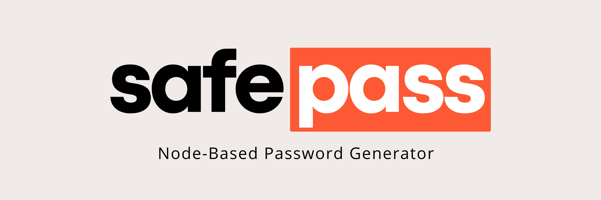

# SafePass - A Node-Based Password Generator




> A **customizable password generator** written in `Node.js` and executable via the command line. The project's goals are to demonstrate the use of package.json and libraries, ensure good documentation and code readability, show how to use NPM packages, and apply Clean Code principles.

## 💡Features
- Generates random passwords with the desired length and character types.
- Generates passwords with weak, medium and strong strength.
- Supports lower and uppercase letters, numbers and symbols.
- Easy-to-use command line interface.

## 🧠 Principles applied
- Clean code
- Scalability
- Chaos Engineering

## 📚 Libraries used
- Inquirer: ^5.2.0
- Chalk: ^9.1.5
- Nanospinner: ^1.1.0

## ☕ How to use
1. Clone the repository to your computer.
2. Open your preferred terminal.
3. Navigate to the `/safe-pass` directory.
4. Enter:
```bash
npm install
```
5. Run the code by typing:
```bash
npm start
```
6. Follow the prompts to generate a password.

## 🤝 Contributing
If you wish to contribute to this project, feel free to talk to the code owner @RodrigoFrangel.

## ❗Disclaimer
This password generator is for educational purposes only. The creator of this program is not responsible for any damage caused by the use of weak or easy-to-guess passwords. We recommend using strong passwords and not reusing them across multiple accounts.

[⬆ Voltar ao topo](#safe-pass)<br>